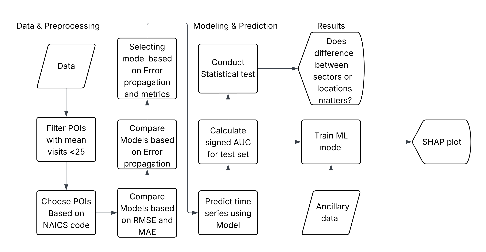
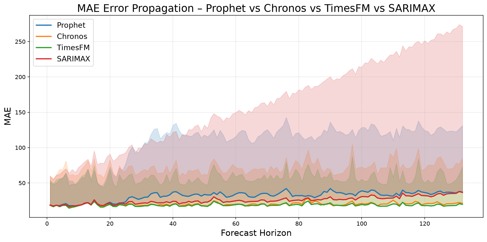
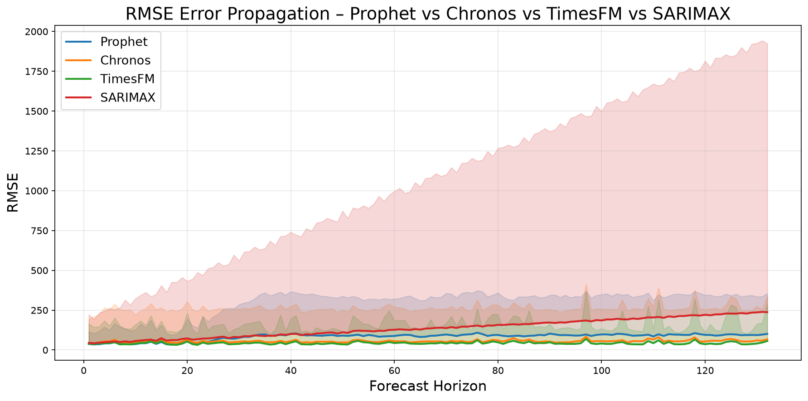
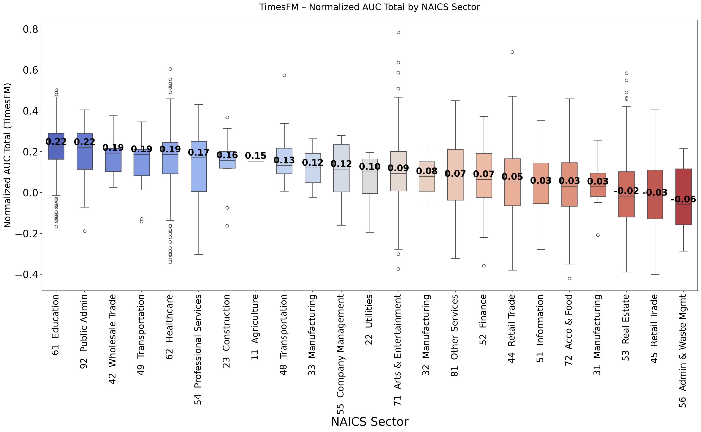
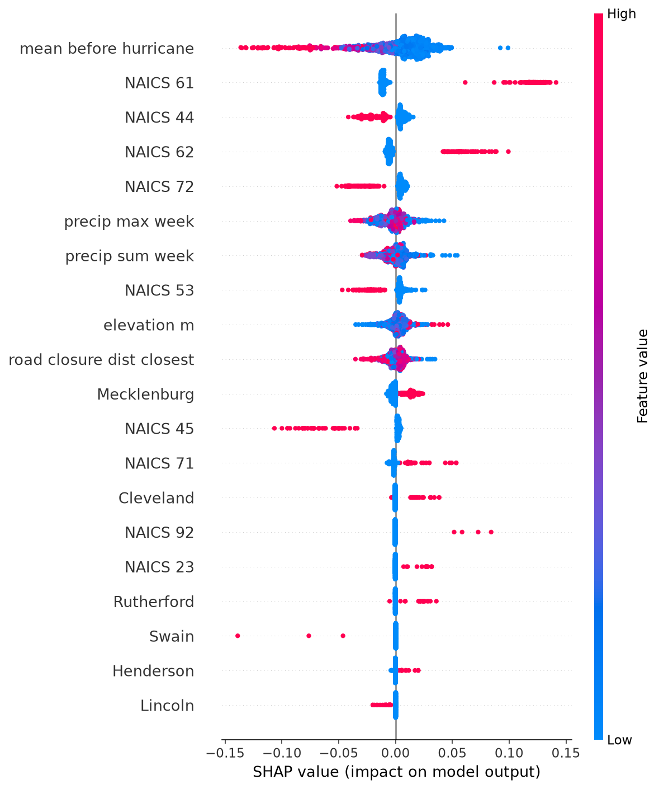
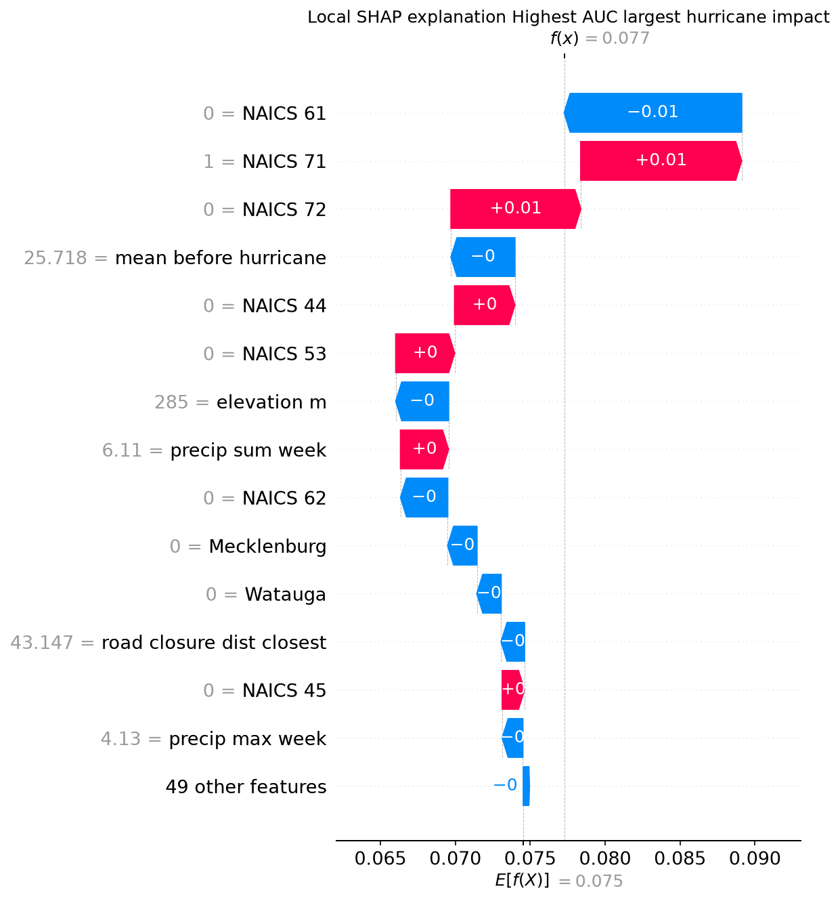
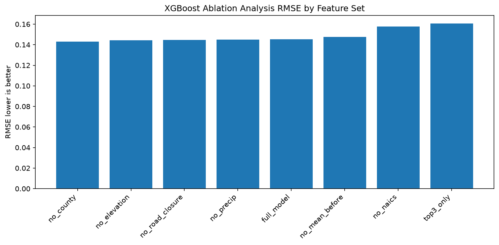

# Resilience and Recovery of Points of Interest Following Hurricane Helene: A Temporal Analysis

[](https://www.python.org/)
[](https://opensource.org/licenses/MIT)

This repository contains the official codebase and analytical pipeline for establishment-level business resilience analysis following Hurricane Helene in western North Carolina. The framework integrates high-resolution point-of-interest (POI) mobility time series, foundation time-series forecasting models, and interpretable machine learning to evaluate recovery patterns.

---

## Table of Contents
- [Resilience and Recovery of Points of Interest Following Hurricane Helene: A Temporal Analysis](#resilience-and-recovery-of-points-of-interest-following-hurricane-helene-a-temporal-analysis)
  - [Table of Contents](#table-of-contents)
  - [Project Overview](#project-overview)
  - [Methodology](#methodology)
  - [Repository Directory Structure](#repository-directory-structure)
  - [Environment Setup](#environment-setup)
  - [Data Requirements](#data-requirements)
  - [Pipeline Usage](#pipeline-usage)
  - [Visualizations \& Key Figures](#visualizations--key-figures)
    - [1. Pre-Event Model Validation \& Comparison](#1-pre-event-model-validation--comparison)
    - [2. Disruption by Business Sector (NAICS)](#2-disruption-by-business-sector-naics)
    - [3. Explanatory SHAP Analysis](#3-explanatory-shap-analysis)
    - [4. XGBoost Feature Ablation Analysis](#4-xgboost-feature-ablation-analysis)
  - [Citation](#citation)
  - [Acknowledgments \& License](#acknowledgments--license)

---

## Project Overview

Natural disasters impact local economies in highly heterogeneous patterns. Aggregate county-level statistics often obscure the recovery challenges faced by individual business establishments. This project addresses this gap by analyzing daily visit counts across **5,671 points of interest (POIs)** in western North Carolina from **May 1, 2023 through February 2, 2025**. 

Using **TimesFM (Time-series Foundation Model)**, we generate counterfactual visitation trajectories representing expected business activity in the absence of Hurricane Helene (which impacted the region beginning September 23, 2024). Disruption and recovery trajectories are quantified at the individual business level using a **normalized signed Area Under the Curve (AUC)** metric.

<!-- Methodology Flowchart -->
  

*Figure 1: Project workflow overview, from raw Dewey/Advan POI visit sequence processing to foundation model forecasting and interpretable machine learning explanation.*

---

## Methodology

The pipeline runs sequentially through the following analytical steps:

1. **Preprocessing & Filtering:** Cleans Advan/Dewey POI visit sequences, removes duplicate geometries, and filters establishments to the western North Carolina disaster impact region (with Wake and Guilford counties as controls).
2. **Pre-Event Model Validation:** Evaluates holdout performance (MAE, RMSE, MAPE, and horizon-wise error propagation) across four models: **SARIMAX**, **Prophet**, **Chronos-T5**, and **TimesFM**.
3. **Counterfactual Forecasting:** Generates long-horizon forecasts for the post-hurricane test period using the best-performing foundation model (TimesFM).
4. **AUC Metric Calculation:** Computes the normalized signed AUC between the scaled predicted and observed visits. 
5. **Confounder & Exposure Integration:** Merges establishment metrics with daily NOAA Stage IV precipitation data, ASTER 30m elevation models, and DriveNC road closure distance records.
6. **Descriptive & Statistical Analysis:** Runs ANOVA and Tukey's HSD tests across NAICS subsectors and county lines to detect significant recovery differences.
7. **Explanatory XGBoost Model:** Trains tree-based regression models to predict AUC variations based on spatial, sectoral, and exposure features.
8. **SHAP Explanations:** Explains feature importance globally and outputs local establishment-level recovery explanations.

---

## Repository Directory Structure

After running the pipeline, results are written to a timestamped folder (`results_YYYY-MM-DD_HH-MM-SS/`) and synced to a static `results_latest/` directory at the repository root.

```text
.
├── README.md                      # Setup, usage, and project overview documentation
├── requirements.txt               # Unified list of Python dependencies
├── poi_resilience_analysis.ipynb  # Integrated Jupyter notebook
│
├── data/                          # Local dataset directory
│   ├── raw/                       # Tabular raw datasets
│   │   ├── final_cleaned_w_cbg.csv            # Dewey/Advan POI visit sequences
│   │   ├── Ruralurbancontinuumcodes2023.csv  # USDA RUCC classifications
│   │   └── RoadClosureIncidents.xlsx          # DriveNC road closures
│   │
│   └── geospatial/                # GIS shapefiles and NOAA rasters
│       ├── nws_precipitation/                 # NOAA precipitation GeoTIFFs
│       └── tl_2020_us_uac20/                  # Census Urban Areas shapefiles
│
└── results_latest/                # Synced folder containing outputs from the latest run
    ├── predictions/               # Test predictions and consolidated metrics (e.g. test_timesfm.csv)
    ├── statistics/                # ANOVA/Tukey tables, LaTeX/CSV Tables 1, 2, and 3, and subsector boxplots
    ├── validation/                # Horizon-wise error propagation results per model
    │   ├── combined/              # Combined MAE, RMSE, and MAPE comparison plots for all models
    │   ├── timesfm/               # Individual TimesFM propagation results and slope histogram
    │   ├── chronos/               # Individual Chronos propagation results and slope histogram
    │   ├── prophet/               # Individual Prophet propagation results and slope histogram
    │   └── sarimax/               # Individual SARIMAX propagation results and slope histogram
    ├── maps/                      # Geospatial POI location and elevation maps
    ├── SHAP/                      # Explanatory global beeswarm and local waterfall SHAP plots
    └── ablation/                  # Feature ablation metrics and performance plot
```

---

## Environment Setup

The forecasting foundation models (TimesFM and Chronos-T5) require **GPU-enabled PyTorch** and CUDA support.

1. **Create and Activate Environment:**
   ```bash
   conda create -n poi_resilience_env python=3.10 -y
   conda activate poi_resilience_env
   ```

2. **Install PyTorch (CUDA 12.1 example):**
   ```bash
   pip install torch torchvision --index-url https://download.pytorch.org/whl/cu121
   ```

3. **Install Requirements:**
   ```bash
   pip install -r requirements.txt
   ```

---

## Data Requirements

To run the notebook successfully, prepare the following local files under the `data/` folder:

- **Establishment Mobility Data (Proprietary):** The Advan weekly foot traffic patterns dataset is available through Advan Research's data licensing program (Advan Research. Foot Traffic / Weekly Patterns [Dataset], 2022. https://doi.org/10.82551/X1PP-1F65). The cleaned visit sequences used in this analysis are derived from raw Advan mobility data by stitching together weekly visit counts across the study period (May 1, 2023 to February 2, 2025). Place the processed file at `data/raw/final_cleaned_w_cbg.csv` with the following required fields: `placekey`, `visits_list`, `GEOID`, `latitude`, `longitude`, `County`, and `naics_code`. 
- **Precipitation Data:** Place the NOAA daily Stage IV CONUS GeoTIFFs under `data/geospatial/nws_precipitation/` using the name format `nws_precip_1day_YYYYMMDD_conus.tif`.
- **Road Closure Data:** Place the DriveNC Excel spreadsheet at `data/raw/RoadClosureIncidents.xlsx`.
- **Urban Boundary Shapefiles:** Place the 2020 Census Urban Areas shapefiles under `data/geospatial/tl_2020_us_uac20/`.
- **USDA RUCC Codes:** Place the Rural-Urban Continuum Codes CSV at `data/raw/Ruralurbancontinuumcodes2023.csv`.
- **Elevation Data:** Queried dynamically from the OpenTopoData ASTER API.

---

## Pipeline Usage

Open the Jupyter environment and run the notebook:
```bash
jupyter lab poi_resilience_analysis.ipynb
```

Cells are organized in sequential order. A full execution will generate all models, compute metrics, write output spreadsheets, and plot recovery figures under `results_latest/`.

---

## Visualizations & Key Figures

Once you complete a run, the generated figures will automatically sync to `results_latest/` and render below.

### 1. Pre-Event Model Validation & Comparison
These plots evaluate model forecasting accuracy over a pre-hurricane holdout window across different forecast horizons.

| MAE Error Propagation | RMSE Error Propagation |
|:---:|:---:|
|  |  |

---

### 2. Disruption by Business Sector (NAICS)
The boxplot displays the distribution of TimesFM normalized signed AUC values across different NAICS business sectors, indicating distinct recovery speeds.



---

### 3. Explanatory SHAP Analysis
These plots identify the variables driving differences in business recovery outcomes.

| Global SHAP Feature Importance | Local Explanation (Sample Waterfall) |
|:---:|:---:|
|  |  |

---

### 4. XGBoost Feature Ablation Analysis
This bar chart shows the impact of removing different feature groups on the prediction accuracy (RMSE) of the final explanatory model.



---

## Citation

If you use this repository or dataset in your academic work, please cite the following manuscript (currently under review):

Gorji Sefidmazgi, A., Gulati, K., & Pandey, V. (2026). Resilience and recovery of points of interest following Hurricane Helene: A temporal analysis. *Transportation Research Record*, *in press*.


```bibtex
@misc{sefidmazgi2025resilience_timesfm,
  title  = {Resilience and Recovery of Points of Interest Following Hurricane Helene: A Temporal Analysis},
  author = {Sefidmazgi, Ali Gorji and Gulati, Komal and Pandey, Venktesh},
  year   = {2026},
  journal = {Transportation Research Record}
  note   = {In Press},
  url    = {https://github.com/Aligo/Resilience-and-Recovery-of-Points-of-Interest-Following-Hurricane-Helene-A-Temporal-Analysis}
}
```

---

## Acknowledgments & License

- **Funding:** Funding for this research was provided by the Center for Regional and Rural Connected Communities (Grant no. 69A3552348304) of the U.S. Department of Transportation, Office of the Assistant Secretary for Research and Technology, University Transportation Centers Program; and National Science Foundation (Grant no. 2200590).
- **Data Access:** POI mobility data obtained from the Dewey Data platform through the Transportation Institute at North Carolina A&T State University.
- **License:** MIT

MIT License

Copyright (c) 2026 Ali Gorji Sefidmazgi, Komal Gulati, Venktesh Pandey

Permission is hereby granted, free of charge, to any person obtaining a copy
of this software and associated documentation files (the "Software"), to deal
in the Software without restriction, including without limitation the rights
to use, copy, modify, merge, publish, distribute, sublicense, and/or sell
copies of the Software, and to permit persons to whom the Software is
furnished to do so, subject to the following conditions:

The above copyright notice and this permission notice shall be included in all
copies or substantial portions of the Software.

THE SOFTWARE IS PROVIDED "AS IS", WITHOUT WARRANTY OF ANY KIND, EXPRESS OR
IMPLIED, INCLUDING BUT NOT LIMITED TO THE WARRANTIES OF MERCHANTABILITY,
FITNESS FOR A PARTICULAR PURPOSE AND NONINFRINGEMENT. IN NO EVENT SHALL THE
AUTHORS OR COPYRIGHT HOLDERS BE LIABLE FOR ANY CLAIM, DAMAGES OR OTHER
LIABILITY, WHETHER IN AN ACTION OF CONTRACT, TORT OR OTHERWISE, ARISING FROM,
OUT OF OR IN CONNECTION WITH THE SOFTWARE OR THE USE OR OTHER DEALINGS IN THE
SOFTWARE.
